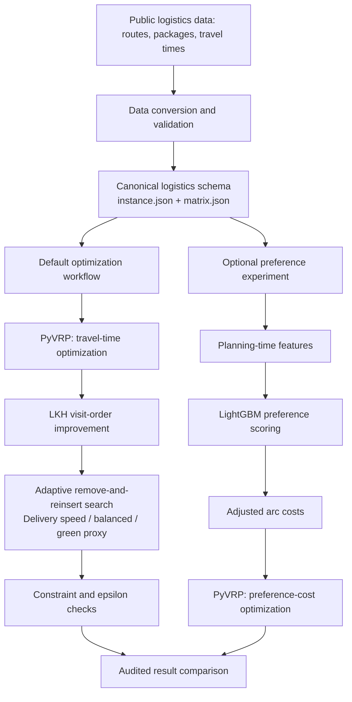

# CargoFlow

**Deadline-Aware Logistics Optimization with Constraint-Guided Preference Costs**

CargoFlow is a lightweight research prototype that combines data analytics,
optional machine learning, and vehicle routing optimization for last-mile delivery using
public operational data. PyVRP ILS first generates a feasible initial route,
after which LKH refines its visit order. Adaptive remove-and-reinsert search
then evaluates delivery-speed, balanced, and green-proxy policies, subject to
capacity and time-window constraints and policy-specific degradation safeguards.

## System pipeline



Both PyVRP nodes use the same solver, with different objective costs.
The LightGBM branch is evaluated independently and is not yet connected to
LKH or adaptive remove-and-reinsert search.

## Repository layout

```text
CargoFlow/
├── configs/              # Frozen route lists and solver/policy settings
├── data/                 # Data instructions and processed tutorial data
├── native/               # C++ search and dynamic-programming code
├── scripts/              # Reproducible command-line workflows
├── src/cargoflow/         # Python package and independent auditors
├── tests/                # Unit and integration tests
└── README.md
```

## Version 1.0

ILS+LKH generates the benchmark seed route. The multiobjective entry point
uses adaptive remove-and-reinsert search by default, with a one-second search
budget per mode. Search candidates undergo fast feasibility and policy-limit
checks; the returned route is independently audited for coverage, capacity,
time windows and policy safeguards relative to the supplied reference route. The 100-route search
comparison is reported below.

## Travel-time solver

**PyVRP ILS + LKH reduces both driving time and solve time while maintaining feasibility.**

Compared with the PyVRP balanced and reference baselines on the same 50 routes
and three random seeds, all three methods achieve **49/50 feasible routes**.
The remaining route has total demand exceeding the capacity of a single vehicle.

Results for random seed 42:

| Method | Feasible routes | Median travel time | Median solve time |
|---|---:|---:|---:|
| PyVRP balanced | 49/50 | 11,729.2 s | 5.12 s |
| PyVRP reference | 49/50 | 11,526.3 s | 16.82 s |
| **PyVRP ILS + LKH** | **49/50** | **11,464.2 s** | **3.83 s** |

Across three random seeds, paired comparisons on the same routes show mean
travel-time reductions of **5.27% versus balanced** and **1.26% versus reference**.
The median paired solve-time ratios are **0.75** and **0.231**, respectively,
corresponding to solve-time reductions of approximately **25.0%** and **76.9%**.

LKH is a third-party solver. The upstream license recorded by this project restricts its use to academic or noncommercial purposes.

## Optional multiobjective policies

`scripts/run_policy_search.py` starts adaptive remove-and-reinsert search from
an independently audited feasible seed route. The entry point compares four
fixed and interpretable modes: travel-time-only, delivery-speed, balanced, and
green-proxy policies.

### Objective model and policy safeguards

Let a closed route be

$$
\pi=(v_0,v_1,\ldots,v_n,v_{n+1}), \qquad v_0=v_{n+1}=0,
$$

where node $0$ is the depot and every customer appears exactly once. Directed
travel time is

$$
T(\pi)=\sum_{k=0}^{n}t_{v_k,v_{k+1}}.
$$

The delivery-speed metric is the sum of customer service-completion times from
the fixed departure:

$$
D(\pi)=\sum_{k=1}^{n}c_{v_k}(\pi),
$$

where $c_i$ includes travel, waiting, and service time up to completion at
customer $i$.

The green metric is a comparative load-adjusted travel-time proxy:

$$
E(\pi)=\sum_{k=0}^{n}t_{v_k,v_{k+1}}
\left(1+\eta\frac{q_k}{Q}\right),
$$

where $q_k$ is the remaining delivery volume before leg $k$, $Q$ is vehicle
capacity, and $\eta=1$ is the default load factor. It compares the loaded
travel effort of different routes.

Active objectives are normalized against the audited seed route $\pi_0$:

$$
\widehat M(\pi)=\frac{M(\pi)}{M(\pi_0)},
\qquad M\in\{T,D,E\},
$$

with a unit denominator when an active reference value is zero. Policy $p$
minimizes

$$
J_p(\pi)=
w_T^{(p)}\widehat T(\pi)+
w_D^{(p)}\widehat D(\pi)+
w_E^{(p)}\widehat E(\pi).
$$

The version 1.0 presets are:

| Policy | $w_T$ | $w_D$ | $w_E$ | Travel-time epsilon | Additional safeguard |
|---|---:|---:|---:|---:|---|
| Travel-time only (`fastest`) | 1.00 | 0.00 | 0.00 | 0% | Seed travel time as upper bound |
| Delivery speed | 0.25 | 0.75 | 0.00 | 2% | Seed weighted objective as upper bound |
| Balanced | 0.35 | 0.25 | 0.40 | 2% | Seed weighted objective as upper bound |
| Green proxy | 0.10 | 0.00 | 0.90 | 5% | Seed energy proxy as upper bound |

The weights are generated from masked logits:

$$
w_r=\frac{u_r\exp(z_r/\tau)}
{\sum_s u_s\exp(z_s/\tau)},
$$

where $u_r\in\{0,1\}$ switches an objective on or off, $z_r$ is its logit,
and $\tau$ is the softmax temperature. Disabled objectives receive exactly zero
weight. Here, $r$ and $s$ range over $T$, $D$ and $E$.

Search candidates undergo fast checks. Before returning a route, an independent
audit verifies complete customer coverage, fixed departure, a closed tour,
vehicle capacity and service-start time windows. Policy limits use the
audited seed as the reference:

$$
T(\pi)\leq (1+\varepsilon_p)T(\pi_0).
$$

The green policy additionally requires

$$
E(\pi)\leq E(\pi_0).
$$

The final result must also satisfy

$$
J_p(\pi)\leq J_p(\pi_0).
$$

These safeguards allow users to change priorities without overriding
operational feasibility or the declared performance floor.

```bash
python scripts/run_policy_search.py \
  --instance path/to/instance.json --matrix path/to/matrix.json \
  --seed-solution path/to/audited_seed.json \
  --output-dir outputs/policies/example --seconds 1 --seed 42
```

The search is implemented in C++ and compiled automatically on first use with
a C++17 compiler (`c++` by default, configurable through `CXX`). One invocation
compares all four modes; `--seconds` sets the search budget for each mode. The
budget covers policy search, while compilation and seed-route generation are
preparation steps.

Supply a seed-solution JSON whose `route` lists stop IDs in visit order,
starting and ending at the depot. The benchmarked pipeline uses an ILS+LKH
seed. For local experiments, `scripts/select_policy_seed.py` can instead choose
the shorter feasible route from available baseline and ILS outputs. Always use
a new output directory. The entry point validates the seed and reports missing
or invalid input.

The earlier 50-route policy experiment used reference/ILS seed candidates and
measured complete planning time. The **3.83 seconds** in the travel-time table
above instead measures solver-call time in the separate ILS+LKH experiment.

### How adaptive remove-and-reinsert search works

Starting from a feasible seed, the algorithm repeatedly removes a small set of
delivery stops and tries new insertion positions to improve the selected policy:

1. **Remove stops:** choose among random removal, related-stop removal, and removal of stops with high detour costs.
2. **Reinsert stops:** evaluate insertion positions using the policy objective and a lateness penalty, then insert each stop at a low-cost position. Relocation, swaps, and segment reversals provide additional visit-order adjustments.
3. **Adapt the selection:** update each removal strategy's weight according to whether it produces an accepted route or a new best result, giving recently effective strategies more opportunities.
4. **Keep the best protected route:** accept improving candidates that pass all safeguards while occasionally accepting slightly worse intermediate candidates to escape local optima. Independently audit the best route before returning it.

### Adaptive remove-and-reinsert search: 100-route comparison

The comparison uses **100 routes** spanning **87 station-date groups**. For each
route, all methods start from the same **ILS+LKH seed** and use the same
objectives and safeguards. Each method runs the delivery-speed, balanced, and
green modes with **five random seeds and four search-time budgets** (0.25, 1, 4,
and 8 seconds), for **24,000 runs** in total.

At the **one-second search budget**, each route uses the median objective over
five seeds. Paired differences are averaged first within station-date groups
and then equally across groups. Because each policy objective is normalized to
the seed, the score-point reduction for method $a$ can be read as

$$
\Delta J_{p,a}=100\left[J_p(\pi_{\mathrm{legacy}})-J_p(\pi_a)\right].
$$

It is a reduction in the seed-normalized objective, not a percentage reduction
relative to the legacy search and not a fuel-saving percentage.

| Search method | Delivery speed | Balanced | Green proxy |
|---|---:|---:|---:|
| Legacy Python search | 0.00 | 0.00 | 0.00 |
| Native random search | 3.28 | 1.19 | 1.17 |
| Candidate-neighborhood search | 3.42 | 1.22 | 1.19 |
| **Adaptive remove-and-reinsert search** | **4.29** | **1.84** | **1.61** |

For adaptive remove-and-reinsert search, the corresponding 95% intervals are
**3.25–5.42**, **1.19–2.58**, and **0.91–2.38** points. Based on per-route
medians, the improved/tied/worsened counts are **100/0/0**, **96/4/0**, and
**89/11/0**. The adaptive method ranks first by the grouped quality statistic
in all **12 policy-by-budget combinations**.

## Current status

Version 1.0 implements the canonical Amazon data contract, route conversion,
PyVRP ILS, LKH visit-order improvement, independently audited adaptive
multiobjective policy search, fixed multi-route benchmarks, and an optional
learned preference-cost experiment.

The tutorial demonstrates the single-route workflow; the fixed multi-route
experiments above provide benchmark comparisons.

## Run the current baseline

Install Python 3.11+ and the pinned solver dependency:

```bash
python -m pip install -e ".[dev]"
```

A processed real route is included, so no raw-data download is needed for
the tutorial. See [`data/README.md`](data/README.md) for its source, license,
preprocessing and the optional policy-search step. Run:

```bash
python scripts/solve_route.py --instance data/tutorial/instance.json --matrix data/tutorial/matrix.json --output-dir outputs/tutorial/baseline --seed 42 --iterations 5000
```

The baseline uses heuristic search to minimize directed travel time with one
vehicle, fixed departure, a closed tour, volume capacity, full customer coverage
and service-start time windows. It takes the route instance and travel-time
matrix as input; historical visit order supports independent comparisons.

## Run ILS+LKH and adaptive policies

After installing the baseline dependencies above, create an isolated ILS
runtime (macOS/Linux, Python 3.11+, `make`, `curl`, and C/C++17 compilers):

```bash
python -m venv artifacts/runtime_ils
artifacts/runtime_ils/bin/python -m pip install pyvrp==0.13.4
python scripts/build_lkh_runtime.py
python scripts/solve_ils_lkh.py \
  --instance data/tutorial/instance.json --matrix data/tutorial/matrix.json \
  --output-dir outputs/tutorial/ils_lkh --seconds 3.8 --seed 42
python scripts/run_policy_search.py \
  --instance data/tutorial/instance.json --matrix data/tutorial/matrix.json \
  --seed-solution outputs/tutorial/ils_lkh/solution.json \
  --output-dir outputs/tutorial/ils_lkh_policies --seconds 1 --seed 42
```

The build script downloads LKH 3.0.13 from the author's site and applies the
patch required for arbitrary directed travel matrices. A previously downloaded
author archive can be supplied with `--archive path/to/LKH-3.0.13.tgz`.
LKH retains its academic/noncommercial licence. Source downloads, environments,
binaries and generated results stay in ignored local directories.

The ILS runtime is separate from the pinned PyVRP 0.12.2 baseline. The seed is
independently audited before policy search. Use new output directories for
repeat runs; solve times vary with the machine. The historical research
runners under `scripts/` use their experiment inputs separately; the commands
above reproduce the tutorial pipeline using only the included route data and
public dependencies.

## Build and run the 50-route benchmark

The benchmark selector uses route metadata only. It excludes malformed route
records, gives every station at least one route, allocates the remaining slots
proportionally, and then stratifies each station by customer-count quartile.
Ties and quotas have fixed ordering, and selection within each stratum uses the
fixed seed `20260907`. Selection takes place before solving, using metadata
strata to keep the comparison cohort fixed.

Generate the frozen route list once:

```bash
python scripts/select_benchmark_routes.py \
  --route-data data/raw/amazon_lmrrc2021/almrrc2021-data-training/model_build_inputs/route_data.json \
  --output configs/benchmark_routes_50.txt
```

Then run the same 50 routes with one solver seed and iteration budget:

```bash
python scripts/run_benchmark.py \
  --raw-dir data/raw/amazon_lmrrc2021 \
  --route-list configs/benchmark_routes_50.txt \
  --processed-dir data/processed/amazon_lmrrc2021/benchmark_50 \
  --output-dir outputs/benchmark_50 \
  --seed 42 --iterations 5000 --resume
```

The runner validates records in the fixed route list and includes data errors
in the results. It writes `results.csv` and `summary.json`, including total
and median solver time. The full benchmark loads large source files and is
best run on a computer or server with sufficient memory. Conversion sets the
travel-time matrix diagonal to zero.

## Comparison and learned preference cost

Budget presets are recorded in [`configs/solver_budgets.json`](configs/solver_budgets.json).
Run the independent long-form comparison with:

```bash
python scripts/run_comparison.py \
  --raw-dir data/raw/amazon_lmrrc2021 \
  --route-list configs/benchmark_routes_50.txt \
  --processed-dir data/processed/amazon_lmrrc2021/benchmark_50 \
  --output-dir outputs/comparison_50
```

Results are saved as `comparison.csv` and `summary.json` in the output
directory. Each route has entries for historical order, nearest-neighbor,
deadline-greedy and every configured PyVRP configuration/seed, supporting
comparisons of feasibility, driving time and solve time across budgets.

Install `cargoflow[ml]` to run the preference experiment through
`scripts/run_preference_replay_v3.py`. The workflow splits data by station–date,
trains and validates the model, selects preference weights from validation
results, and evaluates held-out application data. First, generate the training
data manifest:

```bash
python scripts/build_training_manifest.py \
  --raw-dir data/raw/amazon_lmrrc2021 \
  --output-dir artifacts/preference_replay_v3
```

Then run the experiment with the generated manifest and the held-out routes
in `configs/application_replay_holdout.json`. The validation route list is saved to
`artifacts/preference_replay_v3/run/validation_routes_50.txt`.

```bash
python scripts/run_preference_replay_v3.py \
  --manifest artifacts/preference_replay_v3/manifest.json \
  --benchmark-routes configs/benchmark_routes_50.txt \
  --holdout-config configs/application_replay_holdout.json \
  --raw-dir data/raw/amazon_lmrrc2021 \
  --application-route data/raw/amazon_lmrrc2021/almrrc2021-data-training/model_apply_inputs/new_route_data.json \
  --application-package data/raw/amazon_lmrrc2021/almrrc2021-data-training/model_apply_inputs/new_package_data.json \
  --application-travel data/raw/amazon_lmrrc2021/almrrc2021-data-training/model_apply_inputs/new_travel_times.json \
  --application-actual data/raw/amazon_lmrrc2021/almrrc2021-data-training/model_score_inputs/new_actual_sequences.json \
  --budgets configs/solver_budgets.json \
  --preference-config configs/preference_model.json \
  --output-dir artifacts/preference_replay_v3/run
```

The holdout contains 13 application-format routes separated by station–date.
Check `run.json` for execution status. The model produces route predictions
first; `scripts/evaluate_history.py` then compares them with historical order.

Preference weights are selected from validation results: a candidate is adopted
when it improves agreement with historical adjacent-stop pairs while preserving
feasibility and route-time limits. The zero-weight option is retained when it
performs better or candidates offer no improvement. PyVRP evaluates routes
using adjusted costs and computes arrival times and time windows using the
original directed travel-time matrix.
